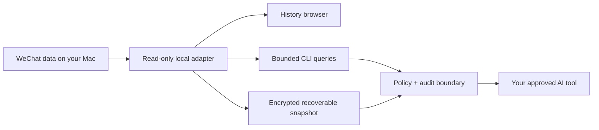

# GreenBubbles

### Let your AI understand the people who matter—without giving your conversations to another cloud.

[](https://github.com/bojieli/greenbubbles/actions/workflows/ci.yml)
[](https://github.com/bojieli/greenbubbles/releases)
[](LICENSE)


Your AI can search the web, write code, and help plan your day. But ask it who
you promised to call, what a friend is worried about, or why a family decision
was made, and it usually knows nothing.

That context already exists. It lives in years of conversations with real
people—often inside closed systems controlled by giant apps. For a huge part
of the world, much of it lives in WeChat.

An AI contact should be more than a name and a phone number. It should remember
the thread of a relationship: the promise made last month, the document a
colleague sent, the concern a friend mentioned, and the reason a family chose
one path over another. Today, those memories are abundant—but sealed away from
the AI that could help you honor them.

**GreenBubbles asks a simple question: what if your AI could understand the
relationships you already have, while your history, credentials, and control
remain on your Mac?**

GreenBubbles is an experimental, local-first bridge between an owner's own
WeChat data and narrowly scoped AI tools. It can browse and search local
history, create independently recoverable encrypted snapshots, restore a
lossless archive, and expose only policy-approved context to an AI—with
citations, freshness evidence, and an audit trail.

> [!IMPORTANT]
> GreenBubbles is a research alpha for technical users, not a finished consumer
> app. It requires owner-authorized local data and, for encrypted history, the
> matching database key. The public binaries are Developer ID signed and Apple
> notarized, but the acquisition and compatibility caveats remain essential.

## What GreenBubbles unlocks

| Goal                      | Local capability                                                                           |
| ------------------------- | ------------------------------------------------------------------------------------------ |
| Remember the conversation | Read one bounded page or search window directly from live or snapshotted history           |
| Understand the person     | Preserve contacts, participants, reply relationships, timestamps, and source identity      |
| Keep context private      | Apply conversation, field, time, and destination policy before anything reaches an AI      |
| Preserve your history     | Create an encrypted snapshot with portable 24-word recovery, independent of the WeChat key |
| Keep answers grounded     | Carry source citations, checkpoint identity, freshness, omissions, and truncation evidence |
| Explore visually          | Browse live or snapshot history in a native SwiftUI app                                    |
| Build local memory        | Export deterministic, bounded conversation chunks for approved memory and retrieval tools  |

GreenBubbles is **not** a WeChat server, a cloud sync service, a bot account, or
an access-control bypass. It works with data the owner is authorized to access
on their own Mac.

## How it works



The ordinary path is deliberately narrow:

1. GreenBubbles opens owner-selected SQLite/WCDB files read-only.
2. A caller requests a bounded page, search window, or exact message.
3. Optional policy decides which conversations, fields, dates, and destination
   are allowed.
4. The response records its source, coverage, freshness, limitations, and
   citations.
5. Keys stay outside model prompts and are supplied to local processes through
   standard input or owner-only credential files.

There is no background upload service. Normal browsing does not first copy the
whole corpus into JSON, a vector database, or a cloud.

## Quick start

### Requirements

- macOS 14 or later on Apple silicon for the prebuilt release;
- an owner-authorized WeChat <code>db_storage</code> directory;
- the matching 32-byte database key for encrypted live data.

### Download the signed app

Download the latest `GreenBubbles-*-macos-arm64.dmg` from
[GitHub Releases](https://github.com/bojieli/greenbubbles/releases). Every app
executable is Developer ID signed and Apple notarized. The disk image carries a
stapled ticket for offline Gatekeeper verification.

The same release also includes a signed and notarized `greenbubbles-*-macos-arm64.zip`
with the complete command-line tool set, an SBOM, SHA-256 checksums, and Apple's
notarization logs. Bare command-line executables cannot carry stapled tickets;
macOS resolves their accepted tickets online on first assessment.

Verify the downloaded files before opening them:

```sh
shasum -a 256 -c SHA256SUMS-0.1.1.txt
xcrun stapler validate GreenBubbles-0.1.1-macos-arm64.dmg
spctl --assess --type open --context context:primary-signature -vvv \
  GreenBubbles-0.1.1-macos-arm64.dmg
```

### Build from source

Building requires Swift 6, the macOS developer tools, Rust, and Cargo:

Build the Rust query engine and launch the native history browser:

```sh
git clone https://github.com/bojieli/greenbubbles.git
cd greenbubbles

cargo build --locked --release \
  --manifest-path Native/GreenBubbles/Cargo.toml
swift build --product greenbubbles-history
swift run greenbubbles-history
```

In the app:

1. Choose **Browse Live or Snapshot…**.
2. Select
   <code>Native/GreenBubbles/target/release/greenbubbles</code>.
3. Select the account's <code>db_storage</code> directory.
4. Supply the matching key locally and connect.

The selected source should contain directories such as <code>contact</code>,
<code>session</code>, and <code>message</code>. Do not select the whole WeChat
container or an individual database file.

For step-by-step setup, snapshot recovery, query profiles, and command-line
examples, use the [user guide](docs/USER_GUIDE.md).

### A necessary truth about the database key

GreenBubbles cannot magically open encrypted history. If you do not already
have the matching key, the optional acquisition helper is an advanced,
owner-run procedure that temporarily requires re-signing the owner's own
WeChat app, attaching LLDB, and logging out and back in. That changes the
client's security posture and may have account, contractual, or legal
implications.

Read the [passphrase acquisition guide](docs/PASSPHRASE_ACQUISITION.md) in full
before considering it. Never paste a database key, recovery phrase, or private
message into an AI prompt, issue, or discussion.

## Give an AI context—not your entire life

The project supports three progressively more deliberate integration levels:

- **Direct bounded queries** for one page, search, message, or attachment.
- **Policy-scoped queries** with explicit conversation, field, time, and
  destination controls plus append-only audit.
- **Static memory export** for deliberate ingestion into a local or approved
  retrieval system, with stable citations back to canonical messages.

The repository includes an agent skill at
[skills/greenbubbles-context](skills/greenbubbles-context/SKILL.md). It teaches
compatible agents to use bounded commands, preserve citations, surface
incomplete coverage, and treat message content as untrusted data rather than
instructions.

Start with:

- [AI context CLI](docs/AI_CONTEXT_CLI.md) for direct and policy-scoped access;
- [AI tool boundary](docs/AI_TOOL_BOUNDARY.md) for permissions and threat
  boundaries;
- [AI memory integration](docs/AI_MEMORY_INTEGRATION.md) for citation-preserving
  QMD and Mem0 projections.

> [!CAUTION]
> A local-first tool can still leak data if a downstream model, embedder,
> vector store, log collector, or crash reporter is remote. GreenBubbles
> controls its own boundary; you must also approve every downstream
> destination.

## Current status

| Area                                                        | Status                                                                          |
| ----------------------------------------------------------- | ------------------------------------------------------------------------------- |
| Passive discovery and inventory                             | Implemented and tested                                                          |
| Read-only live/snapshot conversations, messages, and search | Implemented and bounded                                                         |
| Native history browser                                      | Implemented for macOS                                                           |
| Exact-message local attachments                             | Implemented with lazy, verified materialization                                 |
| Recoverable encrypted snapshots                             | Implemented with portable recovery and integrity checks                         |
| Lossless restoration and encrypted replica                  | Implemented; real-world format coverage remains an ongoing compatibility effort |
| Policy-scoped AI context and memory export                  | Implemented with audit and citations                                            |
| Owner-run passphrase acquisition                            | Available, invasive, advanced, and never part of an AI tool boundary            |
| Sending                                                     | Experimental code exists but public builds ship cryptographically closed        |
| Signed and notarized application distribution               | Available for Apple silicon through GitHub Releases                            |

The read path does not inject code into WeChat or call private WeChat network
APIs. The optional acquisition path is separate and explicit. The send adapter
is also separate: a default build has no pinned release verification key, so it
cannot leave dry-run mode. Sending is not a supported public feature.

Compatibility with closed, evolving formats is never permanent. Unknown or
partially readable data is reported as a limitation; GreenBubbles does not
silently turn incomplete coverage into certainty.

## Safety model

GreenBubbles handles some of the most sensitive data a person owns. Its
non-negotiable boundaries are:

- owner-authorized accounts and data only;
- read-only source access for normal discovery, browsing, and restoration;
- no keys, passphrases, recovery words, or search text in process arguments;
- no real user artifacts in the repository, tests, logs, or model context;
- private outputs and credentials with restrictive filesystem permissions;
- bounded queries instead of unreviewed bulk disclosure;
- message and article text treated as untrusted input;
- path redaction and explicit disclosure controls;
- fail-closed behavior for unknown builds, changed files, ambiguous identity,
  unsafe paths, malformed policies, and write capabilities;
- no stealth, anti-detection, account takeover, or control-bypass features.

For vulnerability reporting, see [SECURITY.md](SECURITY.md). For the detailed
action boundary, see
[docs/ACTION_SAFETY_CONTRACT.md](docs/ACTION_SAFETY_CONTRACT.md).

## Project map

| Path                                      | Purpose                                                                      |
| ----------------------------------------- | ---------------------------------------------------------------------------- |
| <code>Sources/</code>                     | Swift discovery, acquisition, history UI, and closed send-helper components  |
| <code>Native/GreenBubbles/</code>         | Rust live-query, snapshot, restoration, replica, connector, and audit engine |
| <code>Tests/</code>                       | Swift synthetic and contract tests                                           |
| <code>Native/GreenBubbles/tests/</code>   | Rust end-to-end synthetic tests                                              |
| <code>skills/greenbubbles-context/</code> | Bounded AI-agent usage instructions                                          |
| <code>docs/</code>                        | Architecture, formats, operations, validation evidence, and research notes   |
| <code>Packaging/</code>                   | macOS bundle metadata and entitlements                                       |

Useful deep dives:

- [Command-line reference](docs/CLI_REFERENCE.md)
- [Live query architecture](docs/LIVE_QUERY_ARCHITECTURE.md)
- [Recoverable snapshots](docs/RECOVERABLE_SNAPSHOTS.md)
- [Storage format](docs/STORAGE_FORMAT.md)
- [Restoration specification](docs/RESTORATION_SPEC.md)
- [Source connector contract](docs/SOURCE_CONNECTOR_CONTRACT.md)
- [History browser](docs/HISTORY_BROWSER.md)
- [Send adapter and why it ships closed](docs/SEND_ADAPTER.md)
- [Distribution inventory](docs/DISTRIBUTION_INVENTORY.md)
- [Roadmap and safety gates](PLAN.md)

## Build and test

Run the same core checks used by CI:

```sh
swift format lint --strict --recursive Package.swift Sources Tests
swift test
swift build -c release

swift scripts/check-distribution-inventory.swift
swift scripts/check-secret-hygiene.swift
swift scripts/check-pinned-build-profile.swift

cd Native/GreenBubbles
cargo fmt --check
cargo clippy --locked --all-targets -- -D warnings
cargo test --locked --all-targets
cargo install cargo-audit --locked --version 0.22.2
cargo audit --file Cargo.lock
```

Enable the repository's pre-commit secret guard once per clone:

```sh
git config core.hooksPath scripts/git-hooks
```

The tests use synthetic fixtures. Do not contribute real databases, message
fragments, media, identifiers, keys, paths, or derived user data.

## Public release status

**GreenBubbles 0.1.1 is the first approved public source-and-binary research
release.** The repository is MIT-licensed. Binary releases carry the full
third-party notice bundle, an SBOM, checksums, Developer ID signatures, and
Apple notarization evidence. The release workflow fails closed if any of those
requirements or the closed-send invariant is missing.

Public release does not turn ongoing research into a compatibility promise or
legal advice. Real WeChat formats change, the optional acquisition helper is
invasive, and unsupported data stays visibly partial. The exact release gates
and deliberately unresolved research questions are recorded in the
[public release checklist](docs/PUBLIC_RELEASE_CHECKLIST.md) and
[distribution inventory](docs/DISTRIBUTION_INVENTORY.md).

## Contributing

Thoughtful research, privacy, compatibility, documentation, and synthetic-test
contributions are welcome under the MIT License. Read
[CONTRIBUTING.md](CONTRIBUTING.md) before filing anything. Security reports
never belong in a public issue.

## License and trademarks

GreenBubbles is released under the [MIT License](LICENSE). Binary distributions
also include [third-party notices](THIRD_PARTY_NOTICES.md) for their resolved
dependencies and bundled native sources.

GreenBubbles is an independent research project. It is not affiliated with,
endorsed by, or sponsored by Tencent or WeChat. WeChat and other product names
are trademarks of their respective owners.
