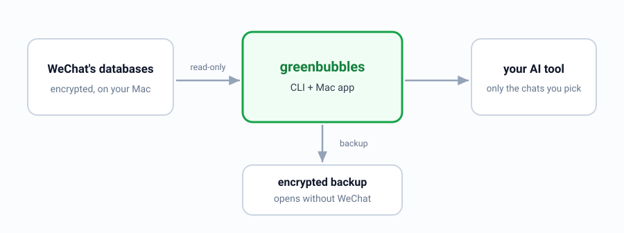

<p align="center">
  
</p>

<h1 align="center">GreenBubbles</h1>

<p align="center">
  <strong>Your WeChat history, readable by an AI, without leaving your Mac.</strong><br>
  A local-first bridge between your own WeChat data and the narrow slice of it you choose to expose.
</p>

<p align="center">
  <a href="docs/USER_GUIDE.md">Get started</a> ·
  <a href="#how-it-works">How it works</a> ·
  <a href="#where-the-project-actually-is">Project status</a> ·
  <a href="docs/README.md">Documentation</a> ·
  <a href="CONTRIBUTING.md">Contribute</a>
</p>

<p align="center">
  <a href="https://github.com/bojieli/greenbubbles/actions/workflows/ci.yml"></a>
  <a href="https://github.com/bojieli/greenbubbles/releases"></a>
  <a href="LICENSE"></a>
  
  
</p>

I have 1,855,548 WeChat messages on this Mac, and my AI tools cannot read one
of them. They sit as 2.98 GB of SQLCipher databases including 6,292 message tables, with
about 59 GB of images, voice notes and documents beside them. WeChat can open
all of it. It does not offer that context to other tools; the matching database
key lives inside the running client rather than in an export you can request.

The export tools that exist solve the wrong half of this. They decrypt the
database and write the whole corpus to JSON — which is exactly the artifact you
should least want sitting on disk, and exactly the wrong thing to hand a model.
A full dump is not context. It is a liability with a search box.

GreenBubbles takes the opposite approach: leave everything where it is, and open it
read-only.

<p align="center">
  
</p>

## What one query actually looks like

Everything below is one process that starts, answers, and exits. No daemon, no
index build, no upload.

```console
$ greenbubbles messages search --profile personal --query-stdin --limit 1
```

```json
{
  "schema": "greenbubbles.query.v1",
  "formatVersion": 1,
  "operation": "messages.search",
  "ok": true,
  "source": { "mode": "liveEncrypted", "identity": "sha256:0f3a…" },
  "consistency": {
    "guarantee": "nativeFtsAndContactReadStatements",
    "databaseCount": 2,
    "crossDatabaseAtomic": false,
    "coverageComplete": false,
    "observedAtUnixMilliseconds": 1787880000000
  },
  "page": { "limit": 1, "returned": 1, "hasMore": true, "nextCursor": "…" },
  "warnings": [{
    "code": "nativeSearchIndexFreshnessUnverified",
    "message": "results come from WeChat's native FTS database; its lag relative to message shards is not independently proven"
  }, {
    "code": "contactDisplayNameUnresolved",
    "message": "one or more contact display names were unavailable; raw identifiers were retained",
    "count": 1
  }],
  "items": [{
    "id": "…",
    "conversationId": "wxid_…",
    "sender": "wxid_…",
    "createdAtUnix": 1787879900,
    "sortSequence": 9042,
    "messageLocalId": 271,
    "messageType": 1,
    "messageTypeLabel": "text",
    "messageSubtype": 0,
    "messageSubtypeLabel": "text",
    "snippet": "…",
    "snippetTruncated": false
  }]
}
```

Four things in that response are the point of the project:

- **`nextCursor`, not an offset.** The next page resumes after the exact
  compound ordering key instead of relying on a shifting row number. For a
  stable run across live mutations, query a snapshot generation.
- **`crossDatabaseAtomic: false`.** A page that touches more than one database
  is not one atomic instant, and saying so is more useful than pretending
  otherwise.
- **`warnings`.** A contact name that could not be resolved is reported. The
  raw identifier stays. Nothing is silently dropped.
- **A stable id per message.** Every citation an assistant produces can be
  fetched back and checked.

The search query arrives on standard input rather than in `argv`, so what you
searched for does not land in your shell history or in `ps` output. So does the
database key.

## How it works

<p align="center">
  
</p>

The read path is deliberately narrow:

1. GreenBubbles opens the account's SQLite/WCDB files with
   `SQLITE_OPEN_READ_ONLY` and `PRAGMA query_only = ON`.
2. A caller asks for one page, one search window, or one exact message. There
   is no `--all`, and no way to pass SQL.
3. Each statement finishes before anything is serialized, so no read
   transaction is held open while a model thinks and WeChat's WAL is not pinned
   across caller work.
4. Optional policy decides which conversations, fields, dates and destination
   are permitted, and appends a hash-chained, body-free audit event.
5. The response carries its source, coverage, freshness and limitations
   alongside the content.

Attachments are resolved only when you ask for one by name. A message page
returns references, not 59 GB of decoded media.

## Install

Requires macOS 14 or later on Apple silicon.

Download the latest `GreenBubbles-*-macos-arm64.dmg` from
[Releases](https://github.com/bojieli/greenbubbles/releases). Every executable
is Developer ID signed and Apple notarized, and the disk image carries a
stapled ticket so Gatekeeper can verify it offline. Verify before opening:

```console
grep ' GreenBubbles-0.1.1-macos-arm64.dmg$' SHA256SUMS-0.1.1.txt | \
  shasum -a 256 -c -
xcrun stapler validate GreenBubbles-0.1.1-macos-arm64.dmg
```

The second command needs Apple's command-line developer tools. After
verification, open the disk image, copy **GreenBubbles** to Applications, and
launch it. The packaged app selects its bundled `greenbubbles` CLI
automatically.

The same release ships `greenbubbles-*-macos-arm64.zip` with the full
command-line tool set, an SBOM, checksums, and Apple's notarization logs. Bare
command-line executables cannot carry a stapled ticket, so macOS checks their
tickets online the first time you run them.

### From source

Needs Swift 6, the macOS developer tools, and Rust:

```console
git clone https://github.com/bojieli/greenbubbles.git
cd greenbubbles
cargo build --locked --release --manifest-path Native/GreenBubbles/Cargo.toml
swift build --product greenbubbles-history
swift run greenbubbles-history
```

When running from source, point the app at
`Native/GreenBubbles/target/release/greenbubbles` when it asks for the CLI.

## Getting your database key

WeChat encrypts its local databases with a 32-byte key it derives at login and
keeps to itself. There is no export button for it, so GreenBubbles ships a
helper that captures it from your own running client and proves it works.
Three commands, about a minute.

**1. Let a debugger attach to your copy of WeChat, then restart WeChat.**

```console
sudo codesign --force --deep --sign - /Applications/WeChat.app
```

macOS refuses to attach to a hardened-runtime binary, so this re-signs the app
ad hoc to clear that flag. GreenBubbles never runs `codesign` for you. Note
that this replaces Apple's signature until you reinstall WeChat or it
auto-updates, and you will repeat this step after an update.

**2. Check that everything the capture needs is in place.**

```console
sudo greenbubbles-acquire preflight
```

This reports whether WeChat is running, whether the hardened-runtime flag is
gone, whether `lldb` is available, and how many database salts it found. It
finds your active account automatically — the one whose databases were written
most recently — or takes `--db-root <path>`. If re-signing is still needed it
prints the exact command. Add `--json` for machine-readable output.

**3. Arm the capture, then log out of WeChat and log back in.**

```console
sudo greenbubbles-acquire capture
```

The logout is the whole trick. WeChat derives its per-database keys *only*
while it is opening them, which happens at login, so `capture` sets a
breakpoint on the system function `CCKeyDerivationPBKDF`, waits (up to five
minutes, `--timeout-seconds` to change it), reads the 32 bytes as they pass
through, and detaches. Nothing is injected and nothing stays hooked.

It then derives each database's key locally with PBKDF2-HMAC-SHA512 and checks
every one against that database's SQLCipher page-1 HMAC, so it reports a key
only after proving it opens your actual files. On a recent run that was 26 of
26 databases in 45 seconds.

Because the breakpoint targets a system library rather than WeChat itself, the
capture is build-agnostic — validated on 4.1.12 and 4.1.13, including 4.1.13's
habit of replacing its process on logout, which `capture` follows
automatically.

### Using the key

It lands in `~/.greenbubbles-acquire/passphrase.txt` as mode-`0600` hex, and is
shaped to be piped straight in:

```console
cat ~/.greenbubbles-acquire/passphrase.txt |
  greenbubbles source status <db_storage> --passphrase-stdin
```

Better, store the path once in a [query profile](docs/QUERY_PROFILES.md) and
stop typing it:

```console
greenbubbles conversations list --limit 100
```

The key is stable, so databases WeChat creates later need no second capture —
`greenbubbles-acquire verify --passphrase-stdin` re-derives and re-checks them
without attaching to anything.

[The acquisition guide](docs/PASSPHRASE_ACQUISITION.md) has the full mechanism,
every failure mode, and what to do when preflight blocks. The capture and
derivation are ported from the MIT-licensed
[`TANGandXUE/wcdb-key-tool`](https://github.com/TANGandXUE/wcdb-key-tool).

## First run

Launch the app and choose **Browse Live or Snapshot…**, then select the
`db_storage` directory for your account — the one containing `contact`,
`session` and `message`, not the whole WeChat container and not a single `.db`
file. Supply the key and connect.

Not sure where your account lives?

```console
greenbubbles-discover accounts --include-paths
```

The [user guide](docs/USER_GUIDE.md) covers snapshots, query profiles and
recovery. The [FAQ](docs/FAQ.md) covers what goes wrong.

## How this differs from the export tools

| | GreenBubbles | Typical WeChat exporters |
| --- | --- | --- |
| Normal output | one bounded page, cited | the whole corpus as JSON/HTML |
| Plaintext copy on disk | none by default | the entire history |
| Reads media | one attachment, when asked | eagerly, or not at all |
| Backup | encrypted, own key, 24-word recovery | a folder of decrypted files |
| Gives a model | what one policy allows, audited | whatever you paste |
| Getting the key | one verified command, then bounded reads | the headline feature |

Exporters are good at what they do, and if you want a readable archive of a
group chat, use one. GreenBubbles exists because "decrypt everything to disk"
is the wrong starting posture when the consumer is a language model.

A fuller treatment, including where those tools are the better choice, is in
[the comparison](docs/COMPARISON.md).

## Where the project actually is

**0.1.1 is a research alpha for technical users.** The read path is
implemented, tested and bounded; the history browser works; snapshots are
recoverable and verified. What follows is what is *not* settled, because that
is the part worth knowing before you install it.

- **No real-corpus latency gate has been met.** The synchronization objective —
  newly persisted text searchable within 60 seconds at p95 — has never been
  demonstrated on a live account. Every number in this repository comes from
  synthetic archives or bounded local samples, and
  [MEASUREMENTS.md](docs/MEASUREMENTS.md) says so on each table.
- **Restoration completeness is proven per-archive, not in general.** The
  auditor proves an archive is internally consistent and its recorded files
  still exist. It cannot prove that an undiscovered WeChat table was absent, or
  that a private field's semantics were read correctly.
- **Compatibility is a moving target.** WeChat 4.1's format is closed and
  changes. Unknown or partially readable data is reported as a limitation, and
  the top-level verdict stays `false` — GreenBubbles will not turn partial
  coverage into a green check.
- **Only Apple silicon is released.** Intel builds are unverified.
- **Sending is closed and stays closed.** Experimental code exists; a default
  build has no pinned release verification key, so it cannot leave dry-run mode.
  It is not a supported public feature, and the
  [send adapter guide](docs/SEND_ADAPTER.md) explains why it ships that way.

The read path does not inject code into WeChat, call private WeChat network
APIs, or contact any server. The optional acquisition path is separate, and is
never reachable from an AI tool boundary.

## What it costs to run

Recorded on an Apple M2 Max, macOS 26.6.2, 2026-08-27 and 2026-08-29. Full
protocol, sample counts and evidence boundaries in
[MEASUREMENTS.md](docs/MEASUREMENTS.md).

| Operation | Median | p95 |
| --- | ---: | ---: |
| Search, native FTS absent, one conversation, 500-message window | — | 246 ms |
| Search, native FTS absent, 16 conversations, 500-message window | — | 352 ms |
| Replica bootstrap, 5,000 messages | 417 ms | 439 ms |
| One new message reconciled | 5.4 ms | 5.8 ms |
| Idle check, nothing changed | 1.2 ms | 1.3 ms |

The slow row is the fallback that runs when WeChat's own full-text index cannot
be used, decrypting a fixed 500-message window to search it. It was 4.4 seconds
before the shard connections were reused across the window. At 352 ms it is
also the reason there is no persistent text cache: a second encrypted copy of
your messages is not worth 350 milliseconds.

## What this will not do

Boundaries that are not up for negotiation, and the reasoning behind each:

- **Owner-authorized data only.** Your account, your machine, your key.
- **Read-only for discovery, browsing and restoration.** The source is never
  written.
- **No secrets in `argv`.** Keys, passphrases, recovery words and search text
  all arrive on standard input, because process arguments are world-readable.
- **No real user data in this repository** — not in tests, fixtures, logs,
  issues, or model context. Every test runs on synthetic data.
- **Message text is untrusted input.** A sentence inside a chat cannot widen
  the policy that released it or select another operation.
- **Fail closed.** Unknown builds, changed files, ambiguous identity, unsafe
  paths, malformed policies and write capabilities all stop the operation
  rather than guessing.
- **No stealth, anti-detection, account takeover, or access-control bypass.**

A local-first tool can still leak everything if the model, embedder, vector
store, log collector or crash reporter behind it is remote. GreenBubbles
controls its own boundary; approving what is downstream of it is your job.
[The threat model](docs/THREAT_MODEL.md) is explicit about which is which.

Vulnerabilities go to [SECURITY.md](SECURITY.md), never to a public issue.

## Documentation

| Document | Contents |
| --- | --- |
| [User guide](docs/USER_GUIDE.md) | First run, browsing, snapshots, recovery, troubleshooting |
| [FAQ](docs/FAQ.md) | The questions people actually ask, including what breaks |
| [CLI reference](docs/CLI_REFERENCE.md) · [Query profiles](docs/QUERY_PROFILES.md) | Every command family; repeatable queries without retyping credentials |
| [Architecture](docs/ARCHITECTURE.md) | Why bounded queries replaced full restoration, with the measurements |
| [Storage format](docs/STORAGE_FORMAT.md) | What WeChat 4.1 writes on disk and how much of it is understood |
| [AI context CLI](docs/AI_CONTEXT_CLI.md) · [tool boundary](docs/AI_TOOL_BOUNDARY.md) · [memory](docs/AI_MEMORY_INTEGRATION.md) | The three integration levels, from bounded query to memory export |
| [Recoverable snapshots](docs/RECOVERABLE_SNAPSHOTS.md) | The key hierarchy, the 24 words, rotation and retention |
| [Measurements](docs/MEASUREMENTS.md) | Every number, with its machine, date, and what it does not prove |
| [Known limitations](docs/KNOWN_LIMITATIONS.md) | What is unproven, unsupported, or known broken |
| [Threat model](docs/THREAT_MODEL.md) · [action safety](docs/ACTION_SAFETY_CONTRACT.md) | Assets, trust boundaries, and the contract governing any outward action |
| [Auditing](docs/AUDITING.md) | Verifying an archive, replica, acquisition chain, or audit journal |
| [Roadmap](docs/ROADMAP.md) | What is next, and the gates each step has to pass |

The full index, including the specifications and the archived development
record, is [docs/README.md](docs/README.md).

The repository also ships an agent skill at
[`skills/greenbubbles-context`](skills/greenbubbles-context/SKILL.md). It
teaches a compatible agent to use bounded commands, preserve citations, report
incomplete coverage, and treat message content as data rather than
instructions.

## Build and test

The checks CI runs:

```console
swift format lint --strict --recursive Package.swift Sources Tests
swift test
swift build -c release

swift scripts/check-distribution-inventory.swift
swift scripts/check-secret-hygiene.swift
swift scripts/check-pinned-build-profile.swift

cd Native/GreenBubbles
cargo fmt --check
cargo clippy --locked --all-targets -- -D warnings
cargo test --locked --all-targets
cargo audit --file Cargo.lock
```

Enable the pre-commit secret guard once per clone:

```console
git config core.hooksPath scripts/git-hooks
```

Tests use synthetic fixtures. Do not contribute real databases, message
fragments, media, identifiers, keys, paths, or anything derived from them.

## Contributing

Contributions to privacy, compatibility, documentation and synthetic tests are
all welcome — see [CONTRIBUTING.md](CONTRIBUTING.md). The most useful thing you
can report is a format GreenBubbles reads incompletely, described structurally,
with no message content attached.

## Repository layout

| Path | Contents |
| --- | --- |
| `Sources/` | Swift discovery, acquisition, history browser, closed send helper |
| `Native/GreenBubbles/` | Rust query, snapshot, restoration, replica, connector and audit engine |
| `Tests/`, `Native/GreenBubbles/tests/` | Swift and Rust synthetic suites |
| `skills/greenbubbles-context/` | Bounded usage instructions for AI agents |
| `docs/` | Guides, specifications, measurements, and the archived record |
| `Packaging/` | macOS bundle metadata and entitlements |

## License

MIT — see [LICENSE](LICENSE). Binary distributions include
[third-party notices](THIRD_PARTY_NOTICES.md) for the shipped runtime dependency
graph and bundled native source. See [PRIVACY.md](PRIVACY.md) for the data
boundary and [SECURITY.md](SECURITY.md) for private vulnerability reporting.

GreenBubbles is an independent research project. It is not affiliated with,
endorsed by, or sponsored by Tencent or WeChat. WeChat and other product names
are trademarks of their respective owners.
