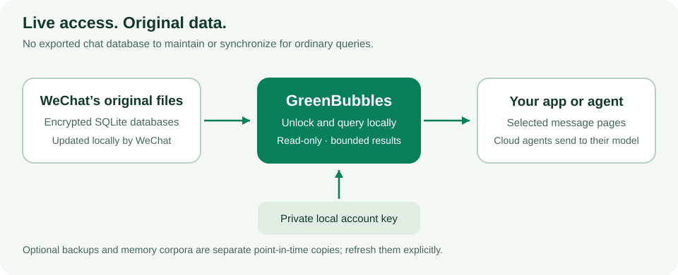
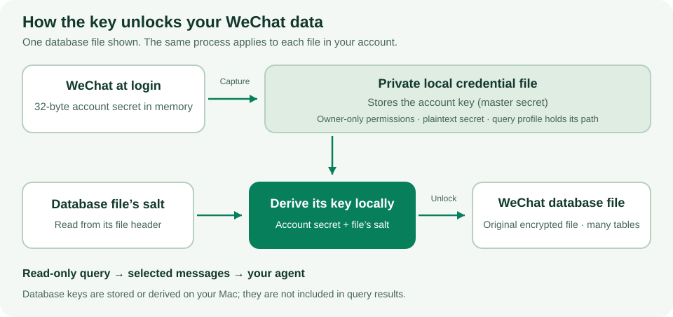

<p align="center">
  
</p>

<h1 align="center">GreenBubbles</h1>

<p align="center">
  <strong>Enable your AI agents to access your WeChat history in real time.</strong><br>
  Mac CLI + skills for agents. Local storage only.
</p>

<p align="center">
  <a href="#install">Install</a> ·
  <a href="#getting-your-database-key">Get your key</a> ·
  <a href="#use-your-existing-coding-agent-recommended">Use with an agent</a> ·
  <a href="docs/README.md">Docs</a> ·
  <a href="docs/WECHAT_DATABASE_FORMAT.md">Database format</a> ·
  <a href="CONTRIBUTING.md">Contribute</a>
</p>

<p align="center">
  <a href="https://github.com/bojieli/greenbubbles/actions/workflows/ci.yml"></a>
  <a href="https://github.com/bojieli/greenbubbles/releases"></a>
  <a href="LICENSE"></a>
  
  
</p>

<p align="center">
  
</p>

GreenBubbles is a Mac command-line tool for reading your own WeChat history.
It reads the database files WeChat already keeps on your Mac, so there
is no export step and no second copy to keep up to date. You can:

- browse and search your chats on your own computer;
- ask a coding agent you already use (Claude Code, Codex, and others) to turn
  chosen conversations into Markdown notes that cite the original messages;
- make an encrypted backup you can open later, even without WeChat.

**Research alpha. Needs a Mac with Apple silicon and macOS 14 or later.**
Setup copies a key out of your own WeChat app, which needs administrator access.
Reading and searching happen entirely on your Mac. If you use a cloud AI, the
messages it reads are sent to that AI's provider.

## What you can do

- **Browse and search:** list chats, read messages, and open attachments.
- **Build notes about your life:** have your coding agent write a private wiki
  from your chats: one short article per part of your life, each fact tied to
  the message it came from. Passwords and keys pasted into chats stay out.
- **Keep notes current:** later runs add only new messages, and Git records
  every change so you can review it.
- **Back up:** make an encrypted copy of your history, protected by a 24-word
  recovery phrase.

GreenBubbles never changes WeChat's files; it only reads them. Backups and notes
are created only when you ask for them.

## Install

You need macOS 14 or later on Apple silicon. Install the command-line tool with
Homebrew:

```sh
brew tap bojieli/greenbubbles https://github.com/bojieli/greenbubbles.git
brew install bojieli/greenbubbles/greenbubbles
```

If Homebrew says the formula is untrusted, run this and then repeat the two
commands above. Older Homebrew versions don't have `brew trust` and don't need it.

```sh
brew trust --formula bojieli/greenbubbles/greenbubbles
```

**Prefer an app?** Download the DMG from
[Releases](https://github.com/bojieli/greenbubbles/releases) and drag
**GreenBubbles** to Applications. It is Developer ID signed and Apple notarized. Releases
also include the command-line tool as a ZIP. See
[CLI releases and Homebrew](docs/HOMEBREW.md) to verify downloads or upgrade.

<details>
<summary><strong>Build from source</strong></summary>

You need Swift 6, Xcode's command-line tools, and Rust:

```console
git clone https://github.com/bojieli/greenbubbles.git
cd greenbubbles
cargo build --locked --release --manifest-path Native/GreenBubbles/Cargo.toml
swift build --product greenbubbles-history
swift run greenbubbles-history
```

The command-line tool is built at `Native/GreenBubbles/target/release/greenbubbles`.
The app asks for this path the first time it runs.
</details>

## Getting your database key

<p align="center">
  
</p>

WeChat encrypts its chat databases. To read them, GreenBubbles needs your
account's key, which it copies from your running WeChat app one time.

This one-time setup needs administrator access and re-signs your copy of
WeChat. The [key setup guide](docs/PASSPHRASE_ACQUISITION.md) has the steps and
troubleshooting help. The key is saved to
`~/.greenbubbles-acquire/passphrase.txt`, a file only your account can read.

After that, commands work with no extra arguments: they find your WeChat data
and key on their own. You need a [query profile](docs/QUERY_PROFILES.md) only
to read a second WeChat account or a backup.

## Use your existing coding agent (recommended)

You can let a coding agent you already pay for do the reading and writing:
Codex, Claude Code, OpenCode, Kimi Code, Gemini CLI, or Grok Build. If you're
signed in with a subscription, this usually costs nothing extra.

GreenBubbles gives the agent a **skill**: a Markdown file of instructions,
with helper files next to it. Nothing needs to be installed. With Homebrew,
this prints where the skill is:

```sh
echo "$(brew --prefix greenbubbles)/libexec/skills/greenbubbles-personal-memory/SKILL.md"
```

Then tell your agent something like:

> Read the GreenBubbles personal-memory SKILL.md at that path. Organize my
> conversations in the recent month into Markdown notes.

If you use the ZIP or a source checkout, the skill is at
`skills/greenbubbles-personal-memory/SKILL.md`; keep the files around it in
place. To have your agent find the skill automatically in future sessions,
copy it into the agent's skills folder:

```sh
# Replace codex with claude, opencode, kimi, gemini, or grok.
python3 "$(brew --prefix greenbubbles)/libexec/scripts/install-skills.py" --agent codex
```

The agent reads messages through GreenBubbles and writes notes on your Mac. If
the agent uses a cloud model, the messages it reads go to that provider. Never
paste your database key or recovery phrase into a prompt.

More help: [agent skills guide](docs/AGENT_SKILLS.md).

## Use the built-in summarizer (optional)

If you don't use a coding agent, GreenBubbles can send chosen chats to Google's
Gemini and save a cited summary as `memory.md` and `memory.json`. Run it
with `ai-summarize-direct`.

This needs your own `GEMINI_API_KEY` and is billed by Google separately. Only
conversations you have explicitly allowed in a policy file are sent. Each run
writes a fresh summary; to keep improving the same set of notes over time, use
a coding agent instead.

Setup steps: [built-in summarizer guide](docs/AI_CONTEXT_CLI.md#model-generated-live-memory).

## Usage

Once the key is set up, these commands read your live WeChat data:

```sh
# List chats, then use an ID from the result.
greenbubbles chats --limit 20
greenbubbles messages list --conversation <conversation-id> --limit 50

# Type what to search for, then press Control-D.
greenbubbles messages search --query-stdin

greenbubbles contacts list --limit 50
greenbubbles message get --conversation <conversation-id> --message <message-id>
```

`messages list` and `messages search` print one line per message: who sent it,
whether it was you, the local time, and the text. Photos, videos, and files
show where they are on disk.

- **More results:** if the output says `hasMore: true`, run the same command
  again with `--cursor` set to the `nextCursor` value it printed.
- **Hide personal details:** add `--redact` to leave out phone numbers, email
  addresses, ID numbers, and links.
- **Message IDs:** add `--json` to see full details, including the message IDs
  that `message get` needs.
- **Which chats matter:** `chats rank` lists your chats by how many messages
  you sent in each, with one-on-one chats first.

Details: [CLI reference](docs/CLI_REFERENCE.md).

**Prefer a window?** Open the app and choose **Browse Live or Snapshot…**. It
reads the same WeChat data as the command-line tool.

## Choose your next step

| I want to… | Read |
| --- | --- |
| Set up and start browsing | [User guide](docs/USER_GUIDE.md) |
| Have my agent write notes from my chats | [Agent skills](docs/AGENT_SKILLS.md) |
| Understand how the notes are organized | [Personal memory](docs/PERSONAL_MEMORY.md) |
| Give an AI access to only some chats | [Give an AI access to only some chats](docs/AI_CONTEXT_CLI.md) |
| Back up and restore my history | [Recoverable snapshots](docs/RECOVERABLE_SNAPSHOTS.md) |
| Fix a problem | [FAQ](docs/FAQ.md) and [known limitations](docs/KNOWN_LIMITATIONS.md) |
| Understand the design | [Architecture](docs/ARCHITECTURE.md) and [threat model](docs/THREAT_MODEL.md) |

Everything else is in the [documentation index](docs/README.md).

## Privacy

Everything GreenBubbles reads or writes stays on your Mac: WeChat's databases,
your key file, backups, and notes. There is no telemetry or update check.

Message text leaves your Mac only when you choose a cloud AI:

- **Your coding agent** sends the messages it reads to its model provider.
- **The built-in summarizer** sends the conversations you allowed to Gemini.

A coding agent that can run commands has the same access to your files as you
do. The skill tells it what to do but cannot restrict it. Notes and backups
contain private information, so protect them as carefully as WeChat's own data.
Details: [PRIVACY.md](PRIVACY.md).

## Status

GreenBubbles is a research alpha for technical users reading their own data.
WeChat changes its private formats; when GreenBubbles meets data it can't read,
it says so instead of guessing. Public builds cannot send messages. See
[known limitations](docs/KNOWN_LIMITATIONS.md).

## Contributing

Contributions are welcome, especially:

- Improve skills and prompts for accurate summaries, citations, and memory updates.
- Fix CLI bugs and make commands easier for people and agents to use.
- Report key-capture failures and compatibility problems with WeChat updates.
- Add CLI options and features that help agents understand message history.

See [CONTRIBUTING.md](CONTRIBUTING.md) to get started. Use synthetic examples in
reports and tests; leave out real messages, databases, keys, and account paths.
Report security issues through [SECURITY.md](SECURITY.md).

## License

MIT — see [LICENSE](LICENSE). Binary releases include
[third-party notices](THIRD_PARTY_NOTICES.md).

GreenBubbles is an independent project, not affiliated with or endorsed by
Tencent. WeChat and other product names are trademarks of their respective owners.
